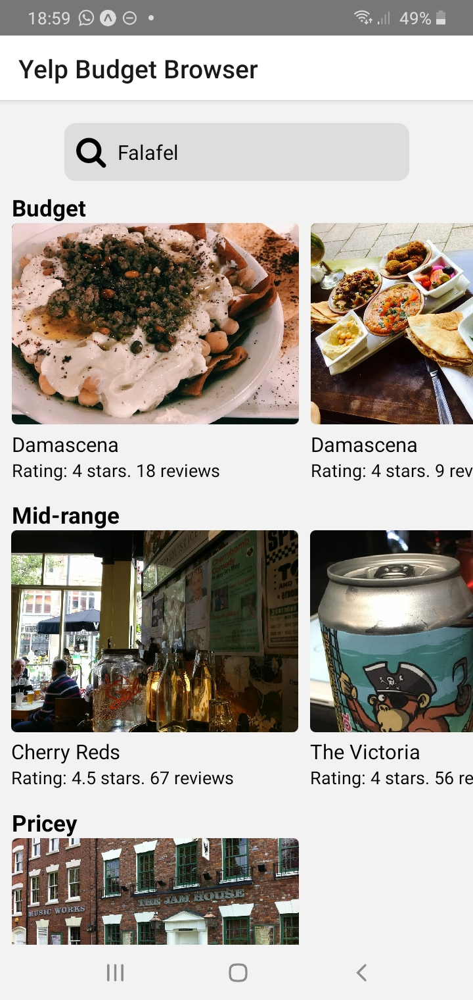
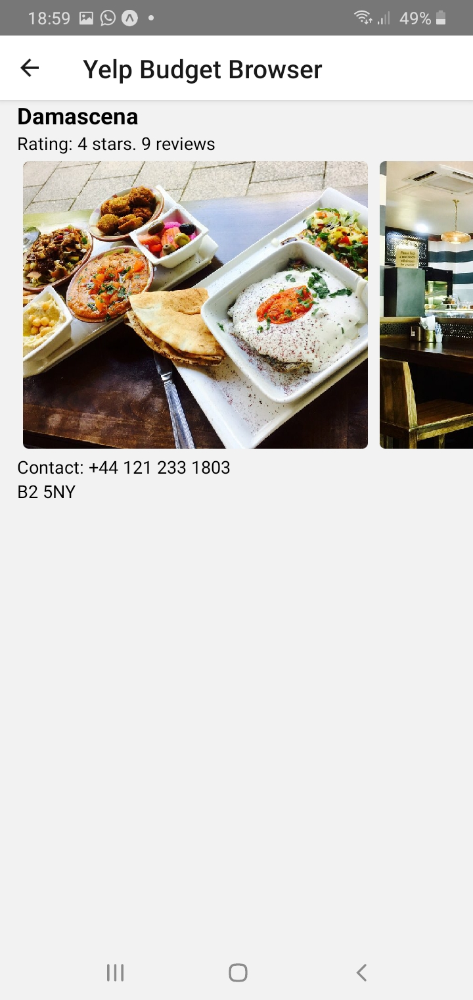

# Yelp Budget Browser

A react-native app used to search for food places, based on budget!

Currently only searches the Birmingham area.

# Installing
## Installing (for development)

1. Ensure Node is installed on your machine
2. Ensure the expo app is installed on your mobile device
3. Follow the steps from the official [react native website](https://reactnative.dev/docs/environment-setup) to set-up expo CLI.
4. Run `npm start`
5. Scan the QR generated by expo in your terminal